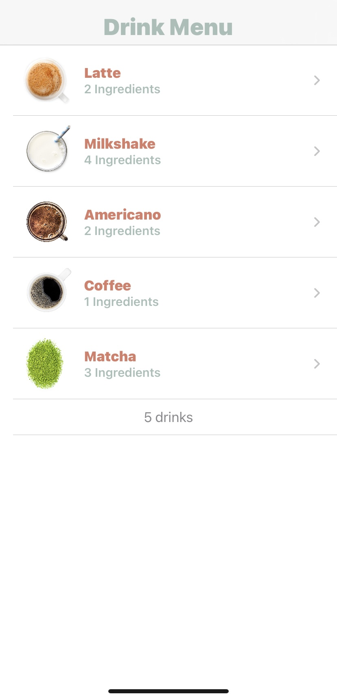

# Cafe Manu iOS Application

### Table of Contents
* [Intro](#Intro)
* [Technologies](#technologies)
* [Screenshots](#screenshots)

### Intro
Simple iOS Cafe Menu App to learn and practice working with XCode, SwuiftUI, and Storyboard. App displays a list of available drinks and navigates to drink details.
    
### Technologies
  <li> Swift Version 5
  <li> XCode Version 12.5.1
  <li> SwiftUI
  <li> Swift Storyboard
   
### Screenshots

    

  
   
  

 </ol>
 
   
 
   
 ---

